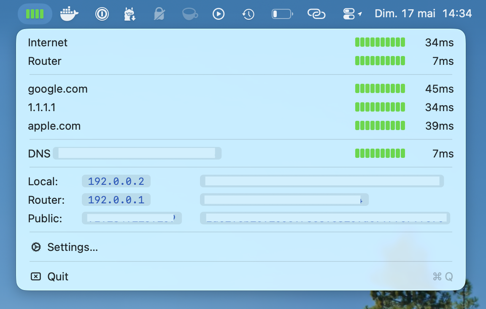

# Netto

A lightweight macOS menu bar app for monitoring internet connectivity health, built in Rust with native AppKit bindings.



## Features

- **Menu bar ping display** — shows latency to your primary target, refreshed every 10 seconds
- **Multiple targets** — monitor several hosts at once (dropdown menu shows all results)
- **Configurable** — add/remove targets via a native Settings window
- **Launch at Login** — optional auto-start via macOS Service Management
- **Lightweight** — native Rust binary, no Electron/webview, minimal resource usage

## Install

```sh
# Build and install to /Applications
bud install
```

Or build manually:

```sh
cargo build --release
mkdir -p target/Netto.app/Contents/MacOS
cp Info.plist target/Netto.app/Contents/
cp target/release/netto target/Netto.app/Contents/MacOS/
cp -R target/Netto.app /Applications/
```

## Development

Requires Rust 1.95+ and macOS 13+.

```sh
bud up      # Setup toolchain
bud run     # Run in development
bud build   # Build debug binary
bud test    # Run tests
bud bundle  # Create .app bundle
```

## Architecture

- `main.rs` — App delegate, status item, dropdown menu, 10s timer
- `ping.rs` — Ping execution (system `ping` command) and output parsing
- `preferences.rs` — Settings window (target list, Launch at Login, footer)
- `settings.rs` — Persistence via NSUserDefaults (JSON)

Key dependencies: `objc2` / `objc2-app-kit` (native AppKit), `objc2-service-management` (Launch at Login), `serde` (settings serialization).

## License

MIT
